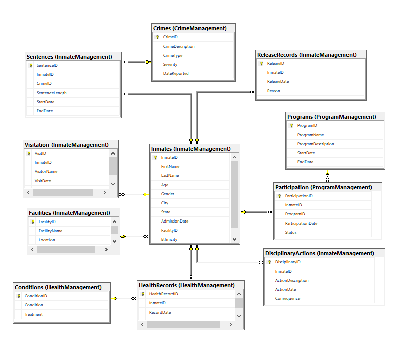

# DEPI Graduation Project - Microsoft Data Engineering Track - Prison Management System

**A Comprehensive Data-Driven Solution for Modern Correctional Facility Management**

---

## Table of Contents  
1. [Project Overview](#project-overview)  
2. [Key Features](#key-features)  
3. [Strategic Advantages](#strategic-advantages)  
4. [System Architecture](#system-architecture)  
5. [Database Design](#database-design)  
6. [ETL Integration with SSIS](#etl-integration-with-ssis)  
7. [Graphical User Interface](#graphical-user-interface)  
8. [Azure Services for Cloud Scalability](#azure-services-for-cloud-scalability)  
9. [Future Roadmap](#future-roadmap)  

---

## Project Overview  
The **Prison Management System (PMS)** is a cutting-edge platform designed to:  
- Optimize prison operations through **data-driven decision-making**.  
- Enhance **inmate rehabilitation programs** and improve **security monitoring**.  
- Provide **actionable insights** into crime trends and policy planning.  

By integrating modern technologies and leveraging cloud solutions, PMS aims to transform correctional facility management into a secure, efficient, and rehabilitative system.  

---

## Key Features  
- **Comprehensive Inmate Management:** Unified database with detailed inmate profiles, including health and disciplinary records.  
- **Crime & Sentencing Analytics:** Tools for analyzing crime patterns and sentencing data to inform policies.  
- **Resource Allocation & Rehabilitation Management:** Optimizes resources and tracks rehabilitation success rates.  
- **Real-Time Reporting:** Advanced dashboards and reports for facility performance monitoring.  

---

## Strategic Advantages  
- **Intuitive Python-Based GUI:** Simplifies user interaction with the system.  
- **Cloud-Enabled Data Analysis:** Powered by Azure Synapse Analytics and Azure Data Lake.  
- **Secure & Compliant:** Implements robust security protocols like RBAC and encrypted data storage.  
- **Scalable Infrastructure:** Supports seamless expansion for growing data and operational needs.  

---

## System Architecture  
PMS operates on a **modern cloud-based architecture**, integrating:  
1. **Operational Database** for real-time inmate data management.  
2. **Azure Data Factory** for data ingestion and transformation.  
3. **Databricks** for data processing under the medallion architecture (Bronze → Silver → Gold layers).  
4. **Azure Synapse Analytics** for data warehousing and analytical reporting.  
5. **Python GUI** for end-user interaction.  

---

## Database Design  
### Design Process  
- **Requirements Analysis:** Identified system objectives and necessary data points.  
- **Entity-Relationship Diagram (ERD):** Defined entities such as `Inmates`, `Crimes`, `Facilities`, and their relationships.  
- **Normalization:** Applied Third Normal Form (3NF) for minimal redundancy.  
- **Implementation:** Tested CRUD operations for integrity and functionality.  

### Key Tables  
- **Inmate Management:** `Inmates`, `Facilities`, `Sentences`, `DisciplinaryActions`.  
- **Crime Management:** `Crimes`.  
- **Health Management:** `HealthRecords`, `Conditions`.  
- **Program Management:** `Programs`, `Participation`.  

---

## ETL Integration with SSIS  
### Objectives  
- Automate data transfer from Excel sheets to SQL Server.  
- Cleanse and integrate data dynamically while maintaining relational integrity.  

### Highlights  
- **Dynamic Data Loading:** Automated mapping from Excel sheets to database tables using SSIS Foreach Loop Container.  
- **Data Cleansing:** Removed duplicates by truncating tables before loading new data.  
- **User Notifications:** Included process notifications via Script Tasks.  

---

## Graphical User Interface  
### Purpose  
- Provides an interactive, centralized platform for managing prison-related operations.  

### Features  
- **Centralized Dashboard:** Access inmate management, release, disciplinary actions, and program assignments.  
- **Technology Stack:** Python (Tkinter, PyODBC), TkCalendar for date selection.  
- **User-Friendly Design:** Modular navigation, error handling, and aesthetic layouts.  

---

## Azure Services for Cloud Scalability  
### Pipeline Overview  
1. **Ingestion:** Data from SQL Server to Azure Data Lake via Azure Data Factory.  
2. **Transformation:** Data cleaned and structured in Databricks under the medallion architecture.  
3. **Storage:** Processed data saved in Azure Data Lake Gen2 (Parquet format).  
4. **Analysis:** Data analyzed and visualized using Azure Synapse Analytics and Power BI.  

---

## Future Roadmap  
- **Advanced Dashboards:** Develop intuitive visualizations for decision-makers.  
- **Real-Time Insights:** Automate live data analysis for immediate feedback.  
- **Machine Learning Models:** Implement predictive analytics to forecast inmate behavior and potential risks.  

---

### Contributors  
- **Moaaz Abu Saif** - Team Leader, Project Manager  
- **Mohamed Salah** - Data Engineer, ETL Developer  
- **Mohamed Mohsen** - Database Designer  
- **Mohamed Rady** - GUI Developer  

For detailed documentation and code, refer to the respective directories in this repository.  

---  
**Empowering correctional facilities with data-driven solutions for a safer future.**  
